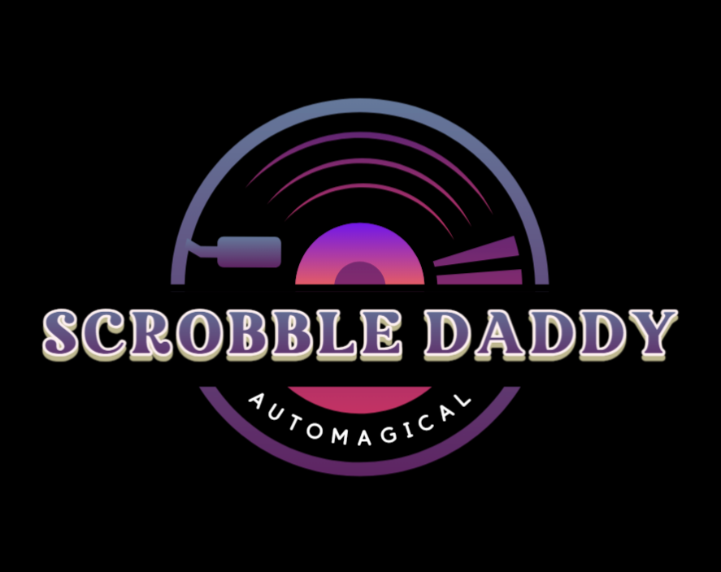

# ScrobbleDaddy 🎶



Scrobble your vinyl to [Last.fm](https://www.last.fm) automatically. ScrobbleDaddy listens to your turntable, identifies the track via Shazam, and scrobbles it — all while displaying a live audio visualizer with album art on your Raspberry Pi.

Built on Python 3.7 for Raspberry Pi.

---

## Features

- 🎵 **Automatic song recognition** via Shazam
- 📡 **Auto-scrobbling** to your Last.fm account
- 🎨 **Live GUI** with album art, track info, play count, and a 200-band audio visualizer
- 🔁 **Runs continuously** — just plug in and play your records

---

## Prerequisites

- Raspberry Pi (3B+ or newer recommended)
- Raspberry Pi OS with Desktop ([download here](https://www.raspberrypi.com/software/))
- USB microphone or audio input device
- Internet connection
- A [Last.fm account](https://www.last.fm/join) with an [API key](https://www.last.fm/api/account/create)

---

## Quick Start

### 1. Flash Raspberry Pi OS

Download [Raspberry Pi OS with Desktop](https://www.raspberrypi.com/software/) and flash it to your SD card using the Raspberry Pi Imager. Boot up your Pi and connect to Wi-Fi.

### 2. Clone ScrobbleDaddy

Open a terminal on your Pi and run:

```bash
sudo apt install -y git
cd ~
git clone https://github.com/YOUR_USERNAME/ScrobbleDaddy.git
cd ScrobbleDaddy
```

### 3. Run the Installer

```bash
bash install.sh
```

The installer will walk you through everything:

- ✅ Installs all system dependencies
- ✅ Downloads and sets up Miniconda (if you don't have it)
- ✅ Creates the Python environment with all packages
- ✅ Asks for your Last.fm username, password, and API key
- ✅ Helps you pick the right audio input device
- ✅ Optionally sets up auto-start on boot

> **You'll need a Last.fm API key.** Create one for free at [last.fm/api/account/create](https://www.last.fm/api/account/create) — just fill in any app name and description.

Once it's done, put on a record and enjoy! 🎶

### Running Manually

After installation, you can start ScrobbleDaddy any time with:

```bash
conda activate ScrobbleDaddyPy
python ScrobbleDaddy.py
```

Press `Esc` to exit.

<details>
<summary><strong>📋 Manual Installation (without the script)</strong></summary>

If you prefer to install things step by step:

**Install system dependencies:**
```bash
sudo apt update && sudo apt upgrade -y
sudo apt install -y git portaudio19-dev libsdl2-dev libsdl2-mixer-dev \
    libsdl2-image-dev libsdl2-ttf-dev libsndfile1-dev
```

**Install Miniconda:**
```bash
wget https://repo.anaconda.com/miniconda/Miniconda3-latest-Linux-aarch64.sh
bash Miniconda3-latest-Linux-aarch64.sh
source ~/.bashrc
```

**Create the Conda environment:**
```bash
conda env create -f ScrobbleDaddyPy.yaml
conda activate ScrobbleDaddyPy
```

**Configure Last.fm** — edit `config.json` and fill in the `lastfm` section:
```json
{
    "lastfm": {
        "username": "YOUR_LASTFM_USERNAME",
        "password": "YOUR_LASTFM_PASSWORD",
        "api_key": "YOUR_API_KEY",
        "api_secret": "YOUR_API_SECRET"
    }
}
```

**Find your audio device:**
```bash
python -c "import sounddevice as sd; print(sd.query_devices())"
```

Update `audio.device_index` in `config.json` to match your microphone.

**Test it:**
```bash
python ScrobbleDaddy.py
```

</details>

---

## Auto-Start on Boot

Once everything is working, you can set ScrobbleDaddy to launch automatically every time your Raspberry Pi boots up. Just run the included setup script:

```bash
bash setup_autostart.sh
```

That's it! Reboot to try it out:

```bash
sudo reboot
```

ScrobbleDaddy should appear on screen about 10 seconds after the desktop loads.

> **What does this do?** It creates a small file at `~/.config/autostart/scrobbledaddy.desktop` that tells your Pi's desktop to launch ScrobbleDaddy on login. The 10-second delay gives your Wi-Fi and desktop time to fully start up first.

#### To Turn Off Auto-Start

If you ever want to stop it from launching on boot:

```bash
bash setup_autostart.sh --remove
```

---

## Configuration Reference

| Section | Key | Description |
|---|---|---|
| `lastfm` | `username` | Your Last.fm username |
| `lastfm` | `password` | Your Last.fm password |
| `lastfm` | `api_key` | API key from Last.fm |
| `lastfm` | `api_secret` | API secret from Last.fm |
| `audio` | `sample_rate` | Audio sample rate in Hz (default: `48000`) |
| `audio` | `chunk_size` | Audio buffer size (default: `8192`) |
| `audio` | `record_seconds` | Seconds to record per recognition attempt (default: `10`) |
| `audio` | `device_index` | Index of your audio input device |
| `gui` | `screen_width` | Display width in pixels (default: `1024`) |
| `gui` | `screen_height` | Display height in pixels (default: `680`) |
| `network` | `timeout` | HTTP request timeout in seconds (default: `10`) |

---

## Troubleshooting

| Problem | Solution |
|---|---|
| **No audio devices found** | Make sure your USB mic is plugged in before booting. Run `arecord -l` to verify it's detected. |
| **Song not recognized** | Move the mic closer to the speaker, or increase `record_seconds` in `config.json`. |
| **GUI doesn't appear on boot** | Make sure you're using Raspberry Pi OS **with Desktop** (not Lite). Try rebooting again — sometimes Wi-Fi takes a moment. |
| **Scrobble fails** | Double-check your Last.fm credentials in `config.json`. Make sure your Pi has internet. |
| **Auto-start not working** | Run `ls ~/.config/autostart/` — you should see `scrobbledaddy.desktop`. If not, re-run `bash setup_autostart.sh`. |

---

## License

MIT
